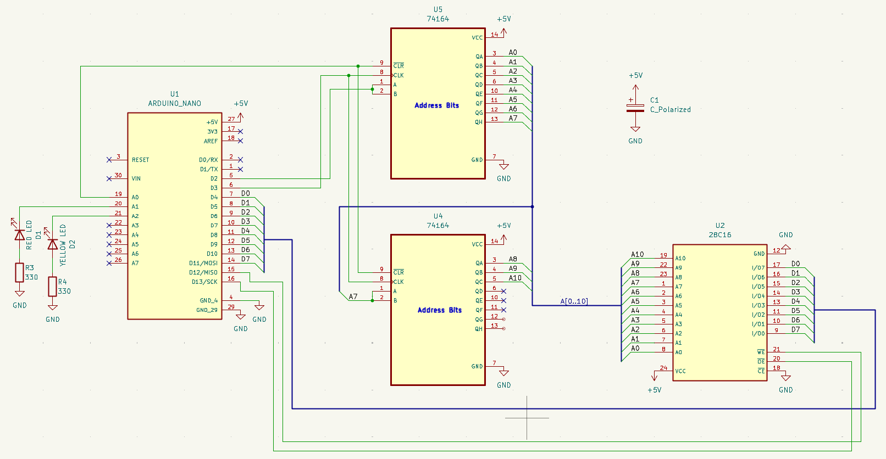
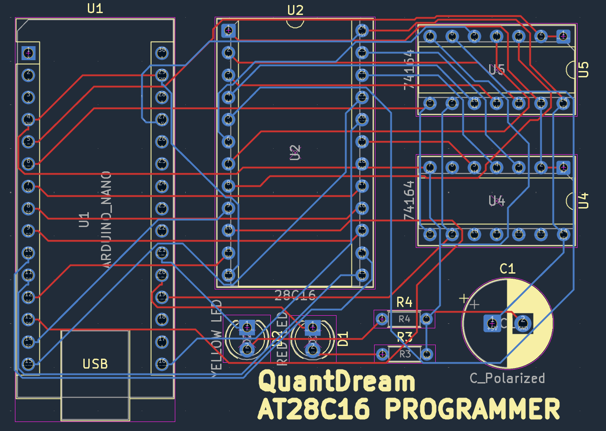
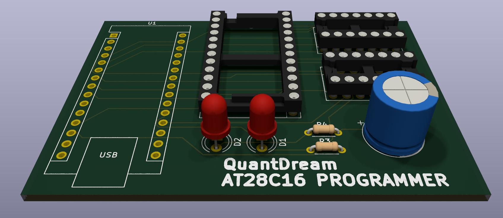

# 🧠 8-bit EEPROM Programmer & Display Decoder

This project implements an EEPROM-based lookup table to convert an 8-bit value into decimal digits using a hardware-only decoding approach.

The EEPROM is programmed using an Arduino Nano Every and a shift-register-driven address bus.

## 📌 Overview

The system:

* Converts `0x00–0xFF` into decimal digits
* Supports both **unsigned** and **two’s complement signed** formats
* Uses EEPROM as a **hardware lookup table**
* Drives a segmented display via precomputed values

## ⚙️ Architecture

* **MCU**: Arduino Nano Every (20 MHz)
* **Shift Register**: 74HC164 (serial → parallel address)
* **EEPROM**: AT28Cxx family
* **Data bus**: 8-bit parallel
* **Control signals**: `WE`, `OE`, `CLR`

Addresses are shifted serially into the 74HC164, while data is written in parallel.

## 🧩 EEPROM Memory Map

### Unsigned (`0x00–0xFF`)

| Address       | Content       |
| ------------- | ------------- |
| `0x000–0x0FF` | Ones          |
| `0x100–0x1FF` | Tens          |
| `0x200–0x2FF` | Hundreds      |
| `0x300–0x3FF` | Sign (`0x00`) |

### Signed (`-128 → 127`)

| Address       | Content                |
| ------------- | ---------------------- |
| `0x400–0x4FF` | Ones                   |
| `0x500–0x5FF` | Tens                   |
| `0x600–0x6FF` | Hundreds               |
| `0x700–0x7FF` | Sign (`0x00` / `0x80`) |

* Digits use `abs(value)`
* Negative numbers use sign byte `0x80`

## 🔢 Segment Encoding

| Digit | Hex    |
| ----- | ------ |
| 0     | `0x7B` |
| 1     | `0x12` |
| 2     | `0xB9` |
| 3     | `0xB3` |
| 4     | `0xD2` |
| 5     | `0xE3` |
| 6     | `0xEB` |
| 7     | `0x32` |
| 8     | `0xFB` |
| 9     | `0xF2` |
| -     | `0x80` |

## 🛠️ Programming Flow

For each byte:

1. Clear shift register
2. Shift 11-bit address (MSB → LSB)
3. Set data bus (`D0–D7`)
4. Pulse `WE` (write enable)
5. Wait for write cycle (~2 ms)

Readback uses the same address logic with `OE` enabled.

## ⚡ Timing Notes

* Arduino @ 20 MHz → ~50 ns per cycle
* `digitalWrite()` already satisfies all timing constraints
* EEPROM write cycle dominates (~1–2 ms)
* No latch in 74HC164 → register is cleared before each address load

## 🖼️ Assets

### Schematic



### PCB



### 3D View



### Gerbers


---

## 📁 Structure

```plaintext
.
├── firmware/
├── hardware/
├── images/
└── README.md
```
